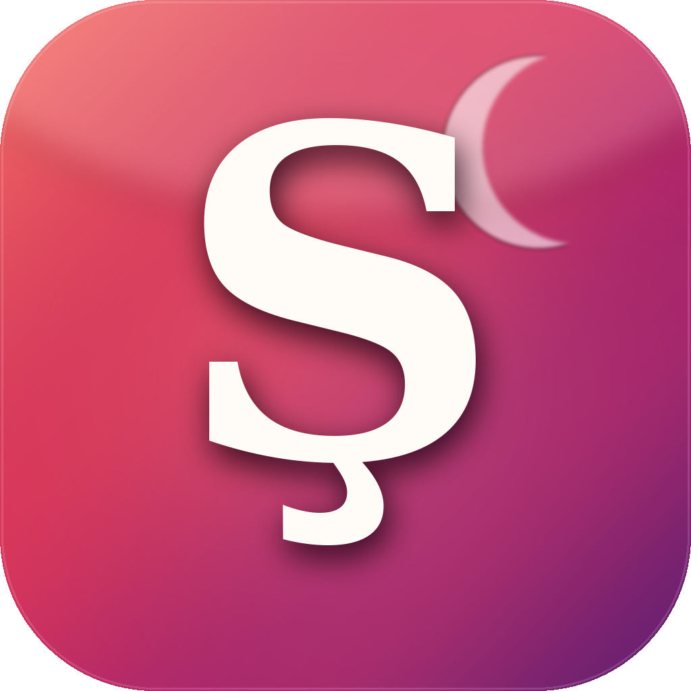

# TurkishCEFR

A native **macOS** app that teaches Turkish, organised by the CEFR framework
(A1 → C2). Written in pure SwiftUI for macOS 14 Sonoma and later.

<p align="center">
  
</p>

## Download & run (no installation needed)

1. Go to the [latest release](../../releases/tag/latest).
2. Download `TurkishCEFR.zip`, double-click to unzip.
3. Drag `TurkishCEFR.app` into `~/Applications` (optional) and double-click to launch.
4. First launch only: **right-click → Open → Open** to approve the ad-hoc-signed
   build (Apple's Gatekeeper shows this once for apps that aren't
   Developer-ID-notarised).

That's it — no installer, no dependencies.

## What's inside

- **24 comprehensive A1 lessons** covering the alphabet, pronunciation, greetings,
  numbers, time, family, colours, pronouns, possessives, plurals, locative case,
  food and cafés, home, routine, present continuous, telling time, weather,
  shopping, directions, transport, body, clothes, hobbies, and questions.
- **A2 – C2 scaffolds** with representative lessons (past, future, conditional,
  aorist, passive/causative, participles, evidential, register & idioms) ready
  to expand.
- Three interactive exercise types per lesson:
  - **Flashcards** with 3-D flip animation
  - **Multiple choice** with instant correctness feedback
  - **Fill-in-the-blank** with free-form text validation
- Native macOS text-to-speech (Turkish voice) on every phrase and vocabulary
  item — tap the speaker icon to hear authentic pronunciation.
- Per-lesson progress tracking with a progress ring per level, persisted
  automatically via `UserDefaults`.
- A modern three-column `NavigationSplitView` UI, translucent materials,
  SF Symbols, level-specific gradients, and a custom app icon.

## Running from source

You need **Xcode 15** on **macOS 14+**.

```bash
# Clone
git clone https://github.com/esfandiari1991/TurkishCEFR.git
cd TurkishCEFR

# Generate the Xcode project (requires XcodeGen)
brew install xcodegen
xcodegen generate

# Open and hit Run in Xcode
open TurkishCEFR.xcodeproj
```

No additional packages or dependencies — the entire app uses Apple frameworks.

### Regenerating the app icon

```bash
python3 scripts/make_icon.py
```

The script writes all ten required sizes into
`TurkishCEFR/Assets.xcassets/AppIcon.appiconset/`.

## Project layout

```
TurkishCEFR/
├── TurkishCEFRApp.swift          # @main entry point, commands, window
├── Info.plist
├── TurkishCEFR.entitlements
├── Assets.xcassets/              # AppIcon, AccentColor
├── Models/
│   ├── CEFRLevel.swift           # A1–C2 with colours, summaries, icons
│   ├── Lesson.swift              # The lesson data structure
│   ├── Vocabulary.swift          # Words with part of speech + examples
│   ├── GrammarNote.swift         # Grammar explanation + examples
│   ├── Exercise.swift            # Flashcard / MC / Fill-in-blank
│   └── Progress.swift            # Per-lesson progress
├── Data/
│   ├── CurriculumStore.swift     # Assembles levels from Content/*
│   ├── ProgressStore.swift       # Persists progress via UserDefaults
│   └── Content/                  # A1Content, A1ContentPart2, A2…C2
├── Views/
│   ├── ContentView.swift         # Three-column NavigationSplitView
│   ├── SettingsView.swift
│   ├── Sidebar/SidebarView.swift
│   ├── Level/LevelOverviewView.swift
│   ├── Lesson/LessonListView.swift
│   ├── Lesson/LessonDetailView.swift
│   ├── Exercise/FlashcardView.swift
│   ├── Exercise/MultipleChoiceView.swift
│   ├── Exercise/FillInBlankView.swift
│   └── Components/               # ProgressRing, GradientBackground, PronunciationButton
├── Utilities/Speech.swift        # Text-to-speech (AVSpeechSynthesizer)
└── …
```

## CI / release pipeline

`.github/workflows/build-release.yml` runs on macOS 14 runners and:

1. Installs XcodeGen.
2. Generates `TurkishCEFR.xcodeproj`.
3. Builds the Release configuration with `xcodebuild`.
4. Ad-hoc signs the resulting `TurkishCEFR.app`.
5. Zips it with `ditto` (preserves resources + metadata).
6. On `main`, updates a rolling **`latest`** GitHub Release.
7. On `v*` tags, publishes a stable GitHub Release with auto-generated notes.

## License

MIT — see [LICENSE](LICENSE).

## Credits

- **Curriculum** aligned with the Council of Europe CEFR descriptors.
- **Turkish language content** curated by the maintainer.
- **Design & implementation** by [@esfandiari1991](https://github.com/esfandiari1991).
